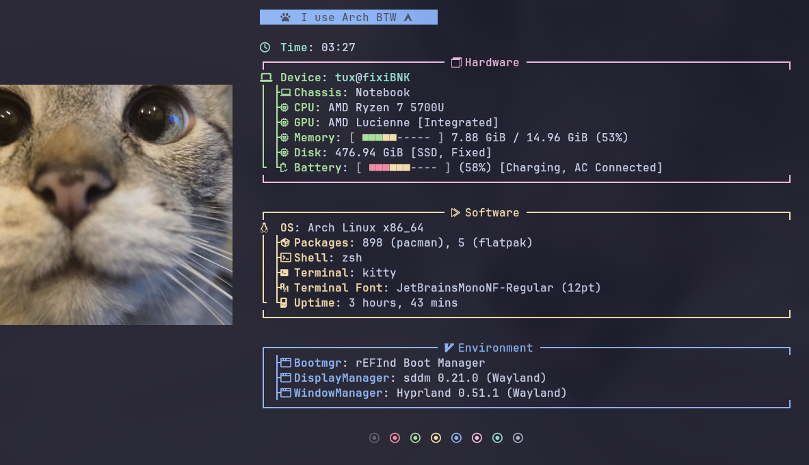
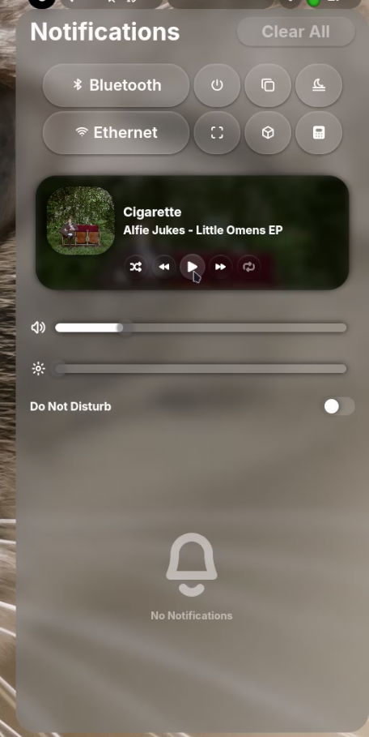
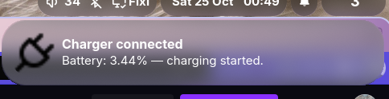
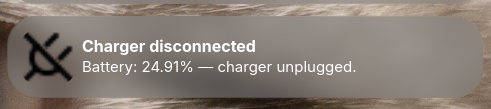
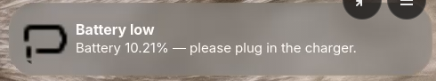
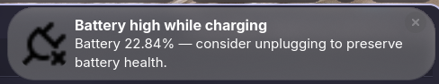
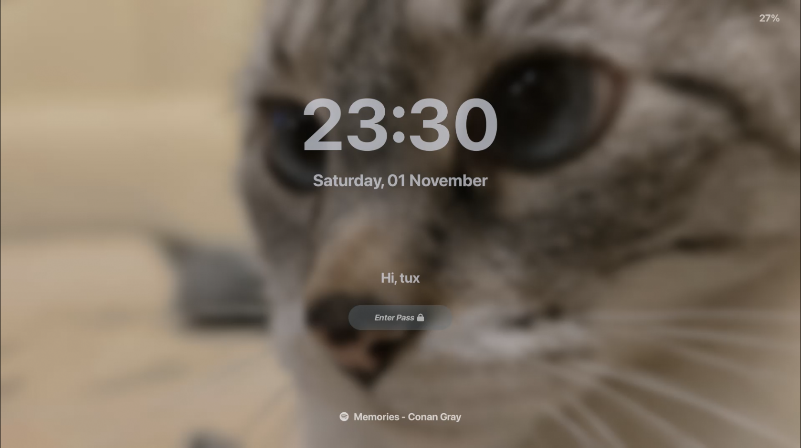

# FixiBar

[](https://archlinux.org)

Where Arch meets aesthetics — powered by my cat 💙



## Installation

> [!IMPORTANT]
> Just for Arch users, btw...

```bash
    curl -fsSL https://github.com/fk2731/FixiBar/main/setup.sh | bash
```

> [!NOTE]
>
> Includes an optional step to sign your kernel for Secure Boot.

## Repository Structure

Here’s a brief overview of the main folders and files:

- `boot/` → Boot-related configurations (rEFInd, Plymouth themes, etc.)
- `config/` → General system and app configs
- `Fixi/` → Fixi Custom scripts and modules (Bar, Widgets, etc.)
- `login/` → Login related configs (SDDM tweaks)
- `pacman.conf` → Pacman package manager configuration
- `setup.sh` → Installation script for Arch Linux
- `utils/` → Screenshots

https://github.com/user-attachments/assets/8aa0e5f4-fde3-4fd8-ad12-6978b12be9a0

## Features

- **NeoVim**:
  - _Theme_: Catppuccin mocha
  - _Lsp, formaters and linters_: Java, Bash, Python, JavaScript, HTML, CSS, Lua, Markdown
  - _Navigation_: Telescope, oil, neo-tree
  - _Buffer_: MultiCursor, AutoComment, LuaLine, Surround, GitSigns

    

- **Terminal**: Kitty
- **Shell**: Zsh with Powerlevel10k
- **Swaync** (Fixi Theme): Notification Center, BackLight Controller, Volume Controller, Mpris Module, Buttons Grid

  

- **Bar** (FixiBar):

  
  - Workspaces
  - Memory Stats
  - Mpris module - Thanks to: [AxKhz-Shell](https://github.com/mariokhz/AxKhz-Shell)
  - Volume Indicator
  - Bluetooth Indicator
  - Network
  - Time, date and calendar
  - Battery indicator (if needed)

    
    
    
    

- **Widgets** (Fixi Custom):
  - Calculator

    

  - Power menu

    

  - Snipping Kit

    

  - Rofi

    

- **Hyprpaper**
- **Hyprlock** (Fixi Theme)

  

- **File Manager**: Nemo (not customized)
- **Display Manager**: SDDM (Fixi Theme)
- **Boot Managaer**: rEFInd (Catppuccin Mocha)

  

- **Plymouth** (Catppuccin Mocha)

  

> [!NOTE]
>
> - `lsd` is an enhanced `ls` command
> - `tldr` is an enhanced `man` command
> - `ogman` is an alias for the original `man` command

## KeyBinds

### Apps

| Action                | KeyBinds  |
| :-------------------- | :-------- |
| Close current app     | Super + C |
| Launch Kitty terminal | Super + Q |
| Launch Swaync         | Super + N |
| Launch Rofi           | Super + R |
| Launch Brave          | Super + B |
| Launch Spotify        | Super + M |
| Launch Calculator     | Super + P |
| Launch Snipping Kit   | Super + Z |
| Launch Power menu     | Super + W |
| Open ChatGPT          | Super + F |
| Open Copilot          | Super + G |
| Launch Telegram       | Super + T |

---

### Navigation & windows

| Action                           | KeyBinds                       |
| :------------------------------- | :----------------------------- |
| Switch window focus in workspace | Alt + Tab                      |
| Move focus left                  | Super + H                      |
| Move focus down                  | Super + J                      |
| Move focus up                    | Super + K                      |
| Move focus right                 | Super + L                      |
| Navigate through workspaces      | Super + Tab                    |
| Move window to another workspace | Super + Shift + &lt;Number&gt; |
| Switch to workspace              | Super + &lt;Number&gt;         |

---

### System

| Action         | KeyBinds          |
| :------------- | :---------------- |
| Launch FixiBar | Super + Shift + B |
| Lock screen    | Super + Shift + L |

## 🤝 Contributing

Contributions, issues, and feature requests are welcome!  
If you want to help improve **FixiBar**, follow these simple steps:

1. Fork this repository.
2. Create a new branch with your feature or fix:
   ```bash
   git checkout -b feature/awesome-idea
   ```
3. Commit your changes and push them:
   ```bash
   git commit -m "feat: add awesome idea"
   git push origin feature/awesome-idea
   ```
4. Open a Pull Request.

> [!TIP]
> Make sure to follow the existing code style and structure for consistency.

## ⚖️ License

This project is licensed under the MIT License.
You are free to use, modify, and distribute it as long as proper credit is given.

[](./LICENSE)
